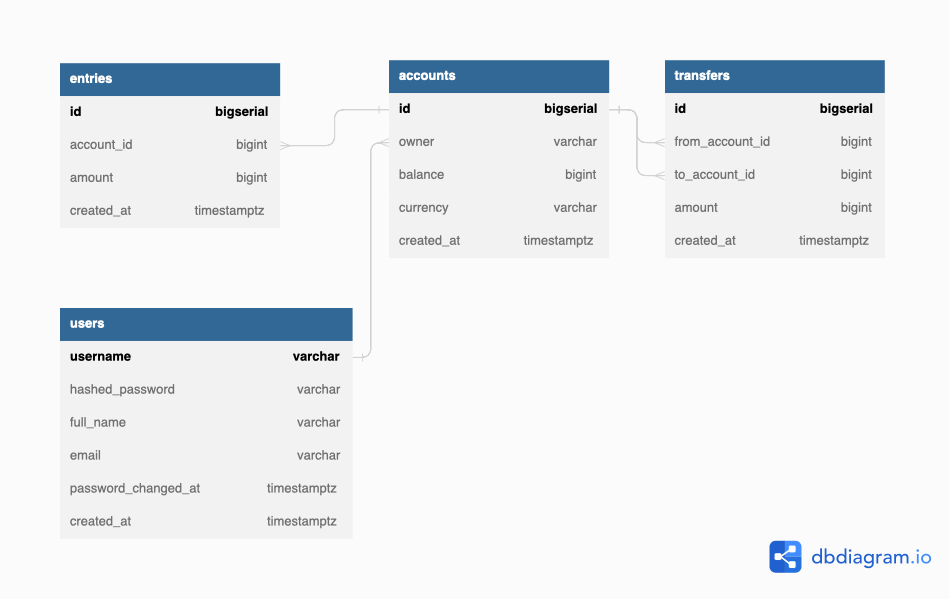

# User Balance API

## Описание
Микросервис для работы с балансом пользователей (зачисление средств, списание средств, перевод средств от пользователя к пользователю, а также метод получения баланса пользователя). Сервис должен предоставлять HTTP API и принимать/отдавать запросы/ответы в формате JSON.

## Схема базы данных



## Настройка среды разработки

### Установка инструментов (под MacOS)

- [Docker desktop](https://www.docker.com/products/docker-desktop)
- [TablePlus](https://tableplus.com/)
- [Golang](https://golang.org/)
- [Homebrew](https://brew.sh/)
- [Migrate](https://github.com/golang-migrate/migrate/tree/master/cmd/migrate)

    ```bash
    brew install golang-migrate
    ```

- [Sqlc](https://github.com/kyleconroy/sqlc#installation)

    ```bash
    brew install sqlc
    ```

### Настройка окружения

- Запуск postgres container:

    ```bash
    make postgres
    ```

- Создание balance_db database:

    ```bash
    make createdb
    ```

- Запуск db migration up all versions:

    ```bash
    make migrateup
    ```

- Запуск db migration up 1 version:

    ```bash
    make migrateup1
    ```

- Запуск db migration down all versions:

    ```bash
    make migratedown
    ```

- Запуск db migration down 1 version:

    ```bash
    make migratedown1
    ```

###  Генерация кода для БД (если вносятся изменения в схему бд)

- Генерация SQL CRUD с помощью sqlc:

    ```bash
    make sqlc


### Запуск

- Запуск сервера:

    ```bash
    make server
    ```

- Запуск тестов:

    ```bash
    make test
    ```

### Пример запросов в Postman

- Создание аккаунта (POST):
    ```bash
    http://localhost:8080/accounts
    {
    "owner": "Artem Fomin",
    "currency": "RUB"
    }
    ```

- Получение информации по аккаунту (GET):
    ```bash
    http://localhost:8080/accounts/1
    ```

- Пополнение баланса аккаунта (POST):
    ```bash
    http://localhost:8080/accounts/balance
    {
    "id": 1,
    "amount": 1000
    }
    ```
- Перевод денег из одного аккаунта в другой (POST):
    ```bash
    http://localhost:8080/accounts
    {
        "from_account_id": 1,
        "to_account_id": 2,
        "amount": 100,
        "currency": "RUB"
    }
    ```